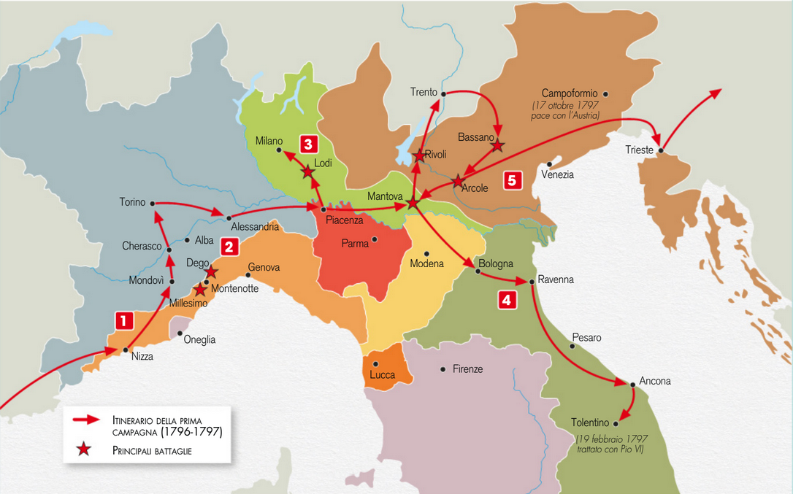
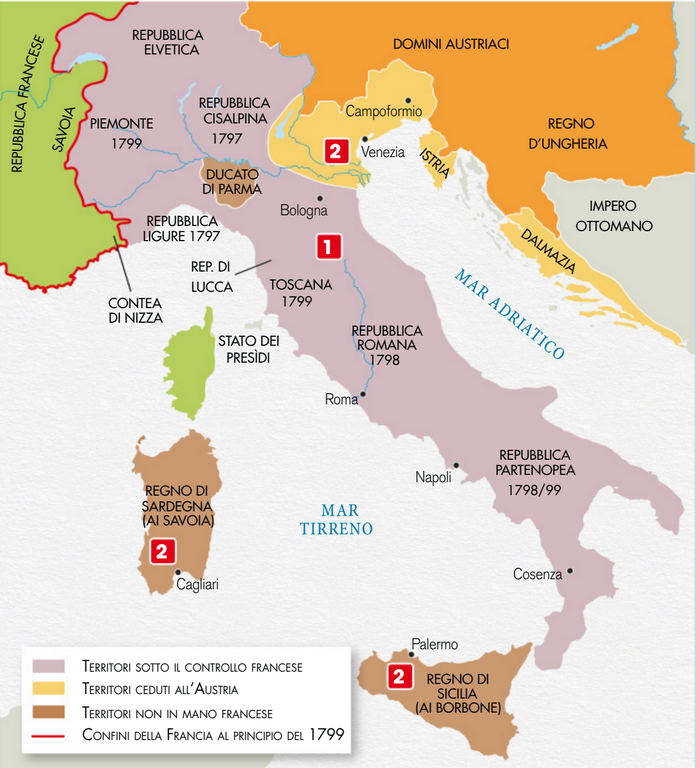
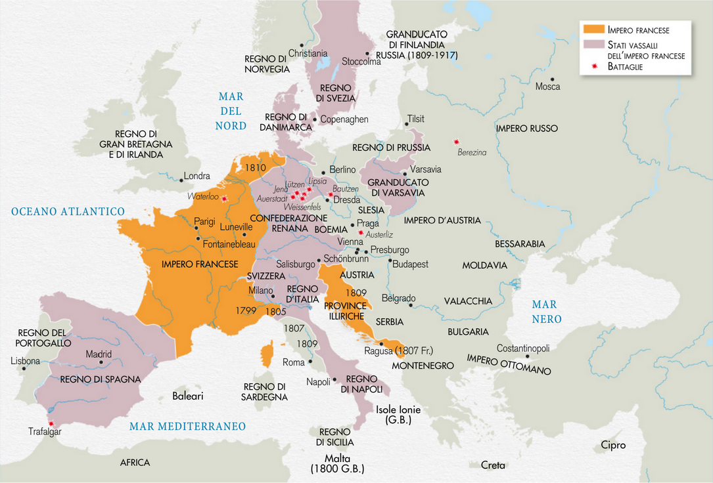

# Età napoleonica

Dal 1795 la repubblica francese era guidata dal **Direttorio**, il paese era scosso da **rivolte interne** e da una **crisi economica e finanziaria**

## Campagna d'Italia

Nella primavera del **1796** il governo decise di rilanciare le campagne militari contro la **coalizione antifrancese**:
> - **Due armate** molto forti avrebbero dovuto avanzare attraverso la Germania fino a **Vienna**
> - **Una terza armata** con generale **Napoleone Bonaparte** partì per la **campagna d'Italia** contro l'Austria

**L'esercito napoleonico** non era gravato dal peso delle scorte e **si muoveva molto velocemente**, la sua strategia privilegiava l'utilizzo dei cannoni. Si fece inoltre accompagnare in battaglia da alcuni topografi e creò una **sezione cartografica**. Bandì poi un concorso e fu inventata la **sterilizzazione degli alimenti** tramite bollitura

> Maggio 1796: Napoleone entra a **Milano**

> Napoleone ruba i **4 cavalli** della Basilica di San Marco

Il generale potè poi puntare verso **Vienna**

> Ottobre 1797: **Pace di Campoformio**:
> La francia ampliò i propri territorio raggiungendo i suoi **confini naturali** e annettendo il **Belgio** e la **Lombardia**. Inoltre creò le **repubbliche sorelle**, tra cui in Italia quelle **ligure**, **cispadana** e **cisalpina**. La Francia sfuttò le **risorse** di queste repubbliche

La campagna d'Italia non bastò a risolvere i **problemi dell'economia francese**, la **Gran Bretagna** infatti gli **impediva di ricevere materie prime**

---

## Campagna d'Egitto

Nel 1798 il Direttorio decise di inviare **Napoleone in Egitto** per **ostracolare i commerci inglesi** nel Mediterraneo, ma ebbe un **esito incerto**:
- Vinse presso le piramidi
- Ad Abu Kir la sua flotta viene affondata dalla marina inglese

---

## Napoleone prende il potere

Mentre la Francia era destabilizzata Napoleone rientrò dall'Egitto e mise in atto un **colpo di Stato** nel novembre 1799 **eliminando il Direttorio** e costituendo un **Consolato** di cui è 1^ console: con potere legislativo

La nuova Costituzione del 1799 pose **fine alla rivoluzione francese** anche con l'eliminazione del preambolo

> Luglio 1801: **concordato con papa Pio VII**:
> - Lo Stato riconosceva la preminenza in Francia del cattolicesimo e si impegnava nel sostentamento del clero
> - La Chiesa rinunciava a rivendicare la restituzione dei beni ecclesiastici

Nel frattempo si era creata una **seconda coalizione antifrancese** che aveva già **abbattuto tutte le repubbliche sorelle**, Napoleone riuscì a **infliggere agli austriaci una durissima sconfitta**
> Marzo 1802: **Pace di Amiens**

> 1804: Napoleone diventa **imperatore** e **re d'Italia**

Nel 1805 è ancora guerra, in 4 anni Napoleone con una grande armata **batte austriaci, russi e prussiani** e impone il suo dominio su tutta l'Europa

> 1807: Napoleone fa costruire l'arco di trionfo

---

## Blocco continentale

Napoleone decreta il **blocco continentale**: vieta a tutta l'Europa di commerciare con l'Inghilterra

> 1812: Il blocco viene **violato dalla Russia** e Napoleone le dichiara **guerra**

Napoleone **assedia Mosca**, ma deve **ritirarsi** per l'arrivo dell'**inverno**, perdendo molti dei suoi soldati

> 1813: **Sconfitta a Lipsia** mentre Napoleone si stava ritirando dalla Russia

---

## Esilio di Napoleone

> 1814: Napoleone viene **esiliato** sull'**isola d'Elba**

In seguito scappa e riprende il potere per **cento giorni**

> 1815: Napoleone viene sconfitto nella **battaglia di Waterloo** che segna la fine del suo impero e del suo potere, i 4 cavalli vengono restituiti a Venezia, Napoleone viene **esiliato** nell'isola di **Sant'Elena**

> 1821: Morte di Napoleone

---

## Le riforme di Napoleone

Napoleone riformò lo Stato francese introducendo il **sistema metrico decimale** e il **codice civile**, riorganizzò il **sistema amministrativo** tramite una gestione **centralistica**:
- I **prefetti** dovevano sovraintendere all'intero sistema delle funzioni pubbliche
- La **polizia** venne riorganizzata per prevenire le forme di dissenso
- Viene creata la prima **Banca di Stato**

Venne anche riorganizzata l'istruzione pubblica: grande attenzione venne riservata ai **licei**, al settore degli **studi tecnici** e alla **scuola politecnica**

> 1804: **Codice civile** o **napoleonico**: non ci sono distinzioni di classe sociale, ma le donne non hanno comunque gli stessi diritti degli uomini, introdotto nel Regno d'Italia nel 1806

Vengono riformate anche
- Le **misure**:
  - **Metro**
  - **Litro**
  - **Chilogrammo**
- La raccolta dei rifiuti
- **Registri** di nascite, matrimoni e decessi diventano compito del municipio e molti compiti che erano prima del sacerdote vengono attribuiti al sindaco
- Viene inventato il **telegrafo ottico**

### Il catasto
| Teresiano | Napoleonico | Oggi |
|-----------|-------------|------|
| Beni e confini misurati in maniera esatta   Suddivisi in lotti   Suddivisi per uso, rendita ed estensione   Utilizzo delle parcelle milanesi   Mappe dettagliate | Catasto unico e centralizzato   Uso delle misure unificate   Strumento affidabile per tassare equamente le proprietà fondiarie dei cittadini   Esempio per tutta Europa | Online   Mappe omogenee e unificate a livello nazionale   Scopo fiscale   Organizzazione dell'urbanistica, civile e giuridica   Suddivisione di terreni e fabbricati |